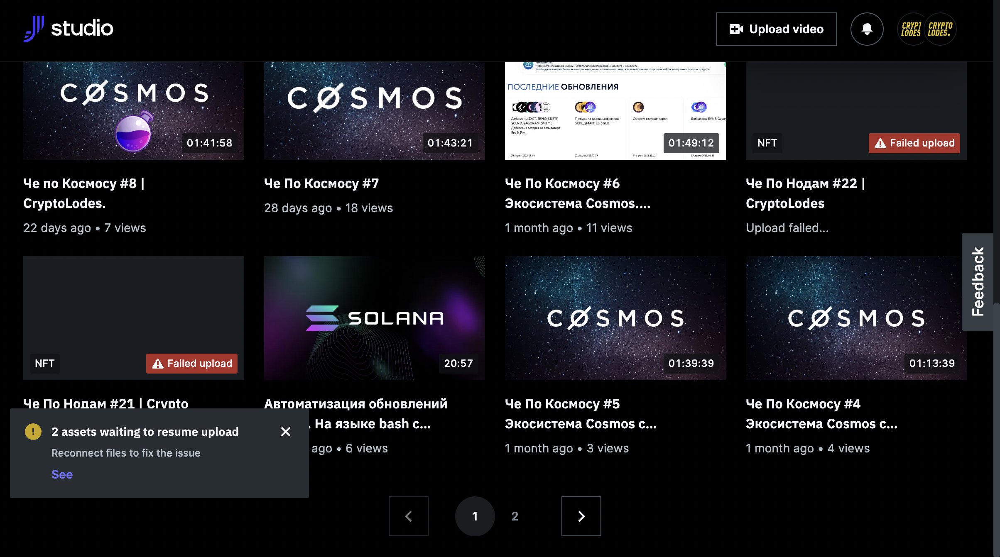

# Feedback:

1. Is the classification of licenses clear?
- “absolutely incomprehensible)”
1. Was the choice of license deliberate?
- “(same here) it is not clear)”

<aside>
⏰ We will write a brief review of the licenses. And I suggest that this be included in the description when the user chooses.

</aside>

1. How clear is the information about the project on the official website? What was missing, and would like to know?
- “also not all is clear
I would like it to be as simple language as possible with clear positioning for people (content-makers from the Web 2.0)
For example: Decentralized YouTube.
And then gradually by making a content to dive into the new functionality
I'm in crypto and I don't fully understand the functionality of the platform
What are the tokens for? And what is a faucet for? And forum?”

- “I still have a few videos that failed to load with an error, and I don't know what to do about them”
- ***June 8, 2022 1:09 PM (GMT+3)*June 8, 2022 1:09 PM (GMT+3)*June 8, 2022 1:09 PM (GMT+3)***
    
    “here's
    I keep coming in with an error:”
    
    
    
    
    
    <aside>
    ⏰ **I found an old worksheet and information on these materials.
    These videos have been censored due to the fact that the material was copied from YT with an impermissible reuse license, and the authorship has not been confirmed. 
    I have uncensored all of this author's materials.**
    
    
    
    </aside>
    
    **But it proves once again how important it is for us to verify authors and communicate with them via form or mail. (example)**
    
    We need to check this video. There is a chance it may not have been fully downloaded after all:
    
    [https://play.joystream.org/video/26408](https://play.joystream.org/video/26408)
    [https://play.joystream.org/video/26407](https://play.joystream.org/video/26407)
    
    I wrote the user what needs to be done. And I also told him about the FM program.