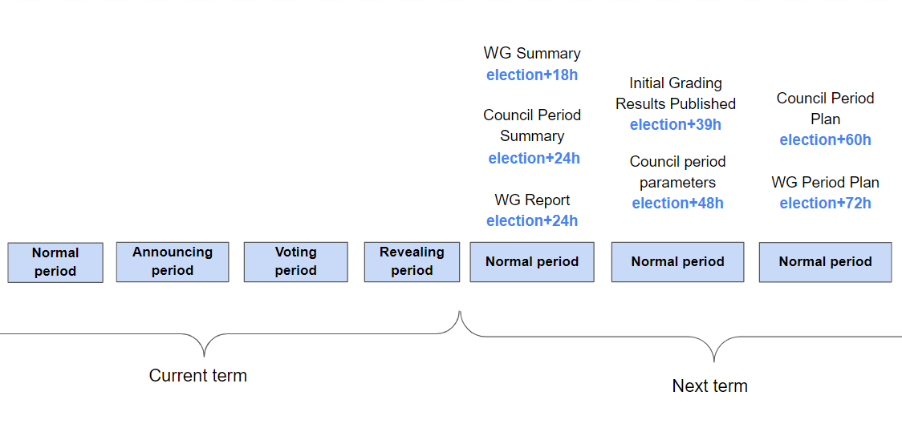

# Archive

<aside>
💡 Everything on this page is archived

</aside>

[Ideas writing format for WGs summary](Archive/Ideas%20writing%20format%20for%20WGs%20summary%200ed1dd28ea6e48b7a42f008c9ac0fc82.md)

# Proposals (ARCHIVE)

So far proposals are not tracked in Notion although each term page has a proposals table (just not accessible to create relations like a db). With this view the council is able create builders tasks for proposals and even assign a builder directly.

1. Add the proposal
2. Click on the cell for `Builders Tasks`
3. Add a title
4. Pick a worker on the new page

[Proposals (ARCHIVE)](Archive/Proposals%20(ARCHIVE)%20dad4d6e51ddc4393b9140e6c237b71aa.csv)

# Workflow (ARCHIVE)

<aside>
💡 During the week log noteworthy events that affect the DAO with short summary, analysis, suggested action items, contact JSG or leads if necessary.
Evaluate global issues to be solved within the term and define steps.

</aside>

- **On Term Start**
    - [ ]  It is necessary to determine the time of the daily Council call. Сreate a vote for the time in the #Council discord channel
    
    ### *Liaisons: Intro for new council members*
    
    <aside>
    💡 **You got elected, great!**
    To make things easier each group lead gets one or two CM as a contact:
    
    </aside>
    
    - First, add new CM to the notion (send dm with email address to @tomato or @l1dev)
    - Second, go through the procedure of linking identification data along the chain on Discord. There are 2 guides: in the form of [video](https://www.loom.com/share/8bcd6358ca61427ca6caba3cc41d3259) and [text](https://www.notion.so/Guide-How-to-complete-on-chain-verification-d5cea53747f64023a6fa87f2c93c0f71?pvs=21).
    - Get acquainted with the following materials to work with:
    
    ***Joystream Workspace ([notion.so](http://notion.so/))***
    
    [***https://dao.joystream.org/#/forum/category/3](https://dao.joystream.org/#/forum/category/3)*** 
    
    - Choose WG: First decision is which group(s) you want to work with as council liaison.
    - Feel free to contact former liaisons or leads for knowledge transfer.
    - Make sure the WG has everything they need: resources, access?
    - Ask for daily updates on notion / discord or forum for important issues / discussions
    - Keep updating the council summary report during the term to make the final submission easier
    - Publishing plan and summary is basically about answering [these questions](https://joystream.gitbook.io/testnet-workspace/testnet/council-period-scoring#scope) on [the forum](https://dao.joystream.org/#/forum/category/4). Eventually this will be copy’paste of parts of the Council Report notion page.
    - The network overview is most of the work: Check that all groups delivered a report, consult lead daily, remind them about about low scores, invite to Council Standup for screenshare to explain things and hopefully you’r done.
    - Some Template Questions to Leads:
        - Does your group have all needed resources, access?
        - Builders: What is the schedule to bring community tools back up?
        - Content: Status on uploads, feedback by content creators?
        - Distribution: How many more workers would you like to hire?
        - Storage: How many more workers would you like to hire?
        - Forum: What is the status of filling the forum with categories and moderation?
        - HR: How many users were added to the CRM last week, who completed bounties or was hired to a WG? This info will be used for ⇒ Bonuses
        - Marketing: What did you do with what effects. What are current and planned campaigns?
    - Agree on council liaisons and review WG reports. WG reports are posted on the [Forum](https://dao.joystream.org/#/forum/category/8)
    - Collect tasks: Which issues do you see that could lower group scores?
    (this will turn into ⇒ Grading eventually)
    - Prepare handover meeting [agenda](Archive/Testnet%20Documents/Handover%20Minutes%20c41b148cdd7d4102b664a8157a6f29a9.md) for the end of Council term on Sunday
    - As Council: Agree and announce WG tasks with bonus opportunities in #council
    - If WGs submitted bounties: review. refine, forward (sub)tasks to HR as bounty suggestion or add goal for another WG
    - Grading: “Score” each group. You can see scoring information for the incentives v3 program [here](https://www.notion.so/b9ea7c6923e74539941477d1a2e083a6?pvs=21) 
    - After the Scores are announced, analyze how the group's results can be improved. Use this information when making Plans and Goals for the working group for the next term
- **On Scores Publication**
    - [ ]  Check new [**Council period parameters](https://joystream.gitbook.io/testnet-workspace/testnet/council-period-scoring#council-period-parameters)** for the current term (election+48h) *
    - [ ]  Make a Budget Allocation (if there are no Council period parameters for the current term, use the previous one)
    - [ ]  Agree on budget during Council Standup
    - [ ]  The Council Period plan must be published [on the forum](https://dao.joystream.org/#/forum/category/3) within 60 hours after the elections ([deadlines](https://joystream.gitbook.io/testnet-workspace/testnet/council-period-scoring#summary-report-and-plan-deadlines))*
    - [ ]  Make a signal proposal Rhodes Council - WG Plan with reference to all Working group Plans
    - [ ]  Remind leads to post a plan on the forum using (election + 72h) 
    - [ ]  Make proposals to update the WG budget. WG should not be allowed to run out of money. Check the current budget of the working groups by the [link](https://dao.joystream.org/#/working-groups)
    - [ ]  Collect proposals on notion ⇒ in the Accounting section
    - [ ]  Calculate Lead Bonuses depending on completed WG tasks
    - [ ]  Add results as `Lead Bonus` and write to the Leads to request their bonuses through the proposal ([here](Archive/Testnet%20Documents/Dynamic%20Lead%20Rewards%20cd618a9f396e4b10ba55e3331c566c22.md))
- **On Election Voting and Revealing**
    - [ ]  [Remind leads](https://discord.com/channels/811216481340751934/812343711870091285/964464706121244762) to submit a WG Summary and the WG report after the new council has been elected ([WG Score](https://joystream.gitbook.io/testnet-workspace/testnet/council-period-scoring/general-working-group-score), [Templates](https://www.notion.so/be098537f6654708ba78445a7ada856a?pvs=21))
- **Next term**
    - [ ]  Prepare topics for the Handover meeting ****managed by **@bwhm.** This needs minutes to inform the rest of the council, the next council, and leads
    - [ ]  Сheck that all Leads have posted WG Summary within 18 hours after the council has been elected on the [Forum Working group](https://dao.joystream.org/#/forum/category/8)
    - [ ]  Councils must prepare a Council Period Summary within 24 hours after the elections. You can find it in the section [Network Summary](Council%20Reports%207b506bc4047840b989ee888283be7a61.md)
        - [ ]  Fill accounting, hires/fires, notion updates, network performance, created proposals, bounties, and recommendations for the next council and Jsgenesis
    - [ ]  Make a signal proposal Rhodes Council - WG Summary with reference to all Working group Summaries
    - [ ]  Сheck that all Leads have posted WG Report within 24 hours after the elections on the [Forum Working group](https://dao.joystream.org/#/forum/category/8)
    
    ________________________________________________________________________________________________________________
    
    **For every 6h the Initial Grading Results are delayed, the plans may be submitted 6h later with no negative impact on the scoring.*
    
    **The Parameters for each new scoring period should be made available within 48h hours of a new Council being elected.
    *Until published, the council should assume they will stay the same until the update is made.*
    

# Scoring (ARCHIVE)

<aside>
💡 Thinking ahead scoring will become a more fluid process with
1. Daily feedback between leads and the council.
2. Live updates on notion when group tasks are completed.
3. Final Scores announcement by JSG (within 35h after term start)
⇒ see [deadlines](https://joystream.gitbook.io/testnet-workspace/testnet/council-period-scoring#summary-report-and-plan-deadlines)

</aside>

Looking forward Council joins the grading process to make more informed decisions about lead rewards and group budgets. ⇒  
CM cooperate with JSG and tomato to update scores on Notion and improve grading tools ⇒ https://github.com/Joystream/joystream/pull/3776: **Add basic incentives grading tools**

Council JOY rewards depend on network score.

[Council Period Scoring](https://joystream.gitbook.io/testnet-workspace/testnet/council-period-scoring#score)

[Joystream Network Score Calculation Sheet](https://docs.google.com/spreadsheets/d/15gOnAR0ur8e0dZWDEQjX1MFzL3b_W4S3Eor7pHPOEqc/edit#gid=0)

[founding-members/4.md at new-incentives-grading · bwhm/founding-members](https://github.com/bwhm/founding-members/blob/new-incentives-grading/council-scoring-period-results/4.md)

[Untitled](Archive/Untitled%20310a39ad4c3840c681239f1add53dc5c.csv)

[Untitled](Archive/Untitled%20e1554cb12650480fab5acaf17518c1b4.csv)

[Lead Bonuses](Archive/Lead%20Bonuses%2043ddd90f19bb4c9e8931cf3c1568d864.md)

[Proposals (archived)](Archive/Proposals%20(archived)%204a61336d7d6f4d1dbce40932c03346d1.md)

[**Testnet Documents** ](Archive/Testnet%20Documents%20c3a6b5461e8541ef8ed4dbeb8c62492e.md)

[Mainnet Council Daily report ](Archive/Mainnet%20Council%20Daily%20report%20f9a88968ee344b7886aff9b28394632c.md)

- **Document Templates**
    
    [WGs Term Plan Template (mainnet)](Archive/WGs%20Term%20Plan%20Template%20(mainnet)%20f89e55f5299447e5a32cc4a810218125.md)
    
    [**Council Plan Template (mainnet)**](Archive/Council%20Plan%20Template%20(mainnet)%20a20119fd28be486ab24f8df5f7a77f65.md)
    
    [**Council Report Template**](Archive/Council%20Report%20Template%20a0e3c5f2949045558bf8152c2ae19966.md)