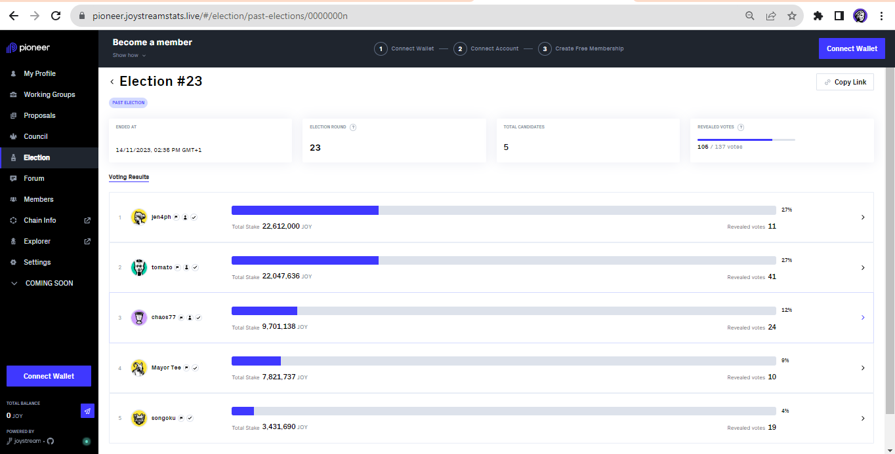

# Report

During the 23rd Council ELection, we had just 1 candidate who declared on the Eligibiity block, which I devised a means of calculation.

According to the SIgnal Text of the approved proposal **Incentivise [Early Applicants To Council](https://pioneer.joystreamstats.live/#/proposals/preview/599):
`(1) Provide grants of 50 USD in JOY equivalent to the candidates who finish in 1st to 4th place in the Council election, provided they applied to the council 3 days before the announcement period ended.`

Methodology**
I have outlined the days involved in the Council election, 9 (announcing stage) + 3 (voting) + 3 (revealing stage) = 15 days election period.
For a candidate to be eligibile, they have to declare within 6 days of the Announcing period, that is, End Term Block (4665621) + 86,400 blocks (6days) = **Eligibility Block

Result**

With the last council election, we had one candidate who made it to into the eligibility block.
Query can be found [here](Query%20aa95910dd0b04244bc73a851bc562b3d.md)

**Image on 23rd Council Election Result**

**Election ID = "0000000n”**

1. "chaos77", "inBlock": 4764758
2. "tomato", "inBlock": 4752204
3. "Mayor Tee", "inBlock": N/A
4. "jen4ph", "inBlock": 4754226
5. "songoku", "inBlock": **4751939**

**Eligibility Block for Reward = <4752021

Candidate(s) to receive incentive for the 23rd Council election = NIL**