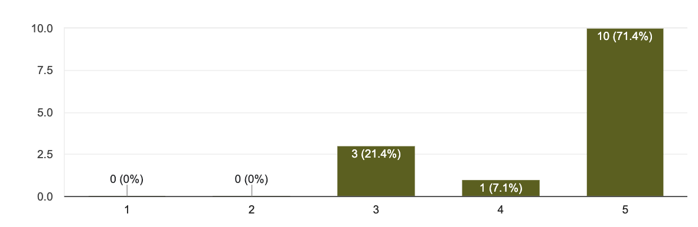
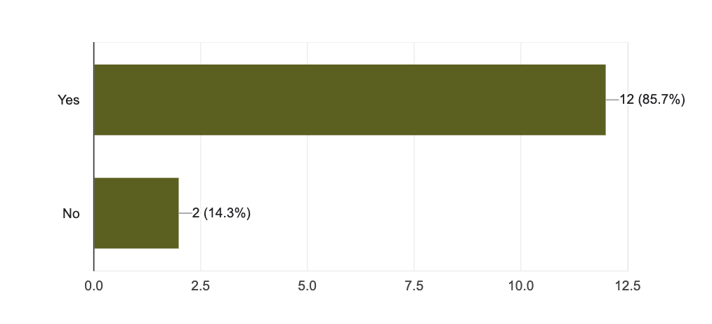

# Feedback

Out of 33 participants, 14 of them have submitted their answers to the questions handed out thru google forms after the activity.

Q1. How satisfied are you with this activity/engagement in Josytream? On as scale of 1-5 (5 being the highest)

Q2. Are you satisfied with the questions and answers?

Q3. How can we improve this engagement?

do more prize places

A lot of questions

I think the scope of compensation for the number of people who participated in the quiz should be expanded. I think the top 20 is appropriate.

It would be great to increase the response time by at least 5 seconds :) English is not my native language and I need a little more time to understand the context. If it is possible. But other things are nice

I think it is necessary after three confirmed likes or comments to send an auto confirmation in the wallet for the application. can reduce the latency of these tasks!

I liked that the team in a personal message reminded me of the quiz

The quiz questions should focus on how the project is set up, not on the reports of the working group and its composition.

All good

It was amazing :) Just I need to be more prepared in the next time :)

more questions about purpose, strategy, affiliation rather than personalities

Put the prefix | Joystream to the nickname on the discord.

Q4. Is this your first time to participate?

10 participants or 71.4% answered YES

4 participants or 28.6% answered NO

Q5. Will you participate again next Sunday?

14 participants or 100% answered YES

Q6. Do you have any suggestions or recommendations to improve Joystream's community engagement?

-no you are fine with that
-Friends, thank you for the opportunity to prove yourself in new project activities
-increase reward
-No
-Add tongues
-More educational content
-It's was my first time in this quiz. And all seems amazing! I was satifiend with quiz. Top 10 is amazing result for me as the first time!
-make mobile version of gleev
-Put the prefix | Joystream to the nickname on the discord.

Q7. Additional comments regarding this activity, if there is any.

-no
-I will list the things I thought while participating in the quiz. That doesn't mean I'm always right. 1. Too many quizzes. 2. The term between the previous quiz and the next quiz is too long. (50s) Reduce the number of quizzes to 10-15 and shorten the duration of the previous and next quiz to around 15 seconds. The wait time is so long that it gets loose. And if you spend too much time on a single event, community members become less engaged.
-while the lack of processing time for likes and comments!
-It may be beneficial to determine the intended participants of the quiz; if the quiz is targeted towards newcomers, it should involve simpler, introductory questions. Conversely, if the quiz is intended for experienced participants, the questions should be more intricate and require a deeper understanding of the project.
-Fewer questions such as: who was the validator and the like
there is an element of luck, too much spread in points from 500 to 1000

Q8. Any overall feedback for the activity?

-Awesome,good jot at Sunday
-no
-We offer JOY tokens as event rewards and NFTs as special rewards. NFTs, such as mystery boxes, attract members' interest.
-If you mean a project. I like the idea and the goal very much :) I've been thinking about the analogy of YouTube for the crypto industry for a long time, and I came across your project :) It surprised me :)
-very inspiring and motivating!
-Good job team
-Put the prefix | Joystream to the nickname on the discord. Add the task to Zealy to get more participants to do so.