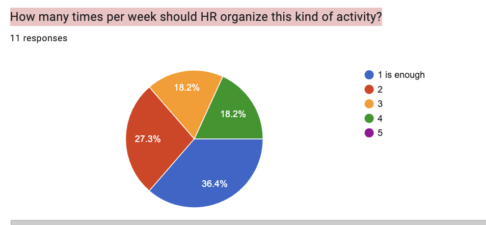

# Feedback

A Google feedback form was sent out after the quiz to improve the next activity.
This time, we got 11  participants who gave feedback

Below are the questions and answer:

1. **Activity satisfaction** - 81.8% said they are satisfied with the activity and the rest not satisfied.

1. **Duration of the quiz** - 54.5% said they are good with it, and the rest are not.
2. Question: Are you satisfied with the questions and answers?

Answers: Only 45% are satisfied with the questions and answers.

1. Question: Do you think this activity promotes engagement in the community?
Answer: 91% of the respondents said this activity promotes engagement in the community.
2. Question: Any thoughts about the participants and the new rules we have added?
    
    Answers: 
    
    no idea😂
    Not aware of rules
    time very fast
    So FAST time for answers
    time was so fast
    the game has sped up. this is great. last time lasted 40 minutes
    The new rule with rewarding participants up to 7th place pleased. Since there are many participants, but only three received the award
    I think the reward for the winner should be increased significantly to foster competition
    
3. Question: How many times per week should HR organize this kind of activity?
    
    
    

1. Question: Do you have anything in mind that HR can do to make you more engaged in the community and the project as a whole?

    
    Answers:
    
    no idea
    Nope
    no
    correct
    I am completely with you. participate in everything
    For me personally, the language barrier is an obstacle to greater involvement in the project. I would also like to see more regular quizzes, this is not only an opportunity to earn some $Joy, but also a reason to interact with the community. And the reward system also affects the involvement in the project))
    No
    
2. Question: Aside from this quiz, what else you can suggest we organize to promote engagement and participation?
    
    Answers:
    
    Nothing more until listing
    +
    yes
    additional rewards for interesting videos, playing poker on JOY, make a blitz
    I think we need more of these quizzes and contests, it makes the community more active and involved
    Outside ama sessions
    
3. Question: Any overall feedback for this quiz?
    
    Answers: 
    
    very fast but it is good
    Should be an easy to guess question and not answers with mathematical expressions 🤔
    very good
    You don’t have time to read a long question, you don’t have time to count answers with calculations, you don’t have time to press the answer button, the bot does not count.
    so so
    The quiz goes by very quickly, and sometimes I just don't have time to read it, because English is not my native language and I need a little more time. I had prepared for it in advance, but some of the answers were like multiplication or division, before and after. I kept specific answers in my head and it was hard for me to quickly recall which events came after or before them. That is, due to the lack of specificity in some of the answers, I did not have time to answer them, even though I knew the answer. It is necessary to either increase the amount of time for answering or to make the answers more specific
    Today was fast and great. long last time
    There was not enough time for a response. Especially for the non-English speakers, this was a huge problem
    it was very fun!
    I think the community should designate a wallet for donations towards increasing rewards for the quiz
    

1. Please provide your discord handle and polkadot address for a chance to win some Joy for your valuable feedback. Thank you so much!
    
    Answers: 
    
    AndDev#6454 address: 5FNuqvYiszPxngGb2qDByQJdeoYDc3wr38tAUEt9DsvpVU7k
    sieemma.
    5GRH2KnwrFi3YrhPEq4smvs3yoPmGdns2e1cxKX9Bt2essBG Misha Shwartz| Kyoko#3799
    britva| Suiswap#7845 j4SR3zsmgtma3Jem8s3bkJv3UTcgi696szJm4xuAU5fgjbFDP
    5DyhQsZaDvkMp6DNw35nCjwMUUKPFz1ZchswSpH3BVDXLST9 mishaworker#7196
    Grizix | Suiswap#1841
    Valeron#0035 j4SpchjRyEZEGo1W62BFL9V1tAtszeN1Ba1RPpJrKy25ecRR5
    Raketa#8129
    Vit7 | Suiswap#6073 ; 0xB7E8fef04C78B403282A100B3886C11C088CABdd
    TzS#9493 / 146GNTZ1qFtgxSx1XRYFTGpLNCaBC3ihec87Y16UT3ZxHMRn
    Vikan#4313