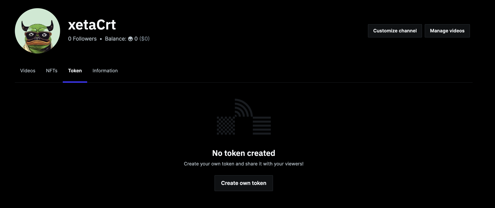
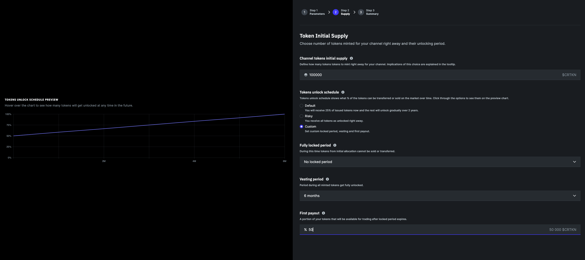
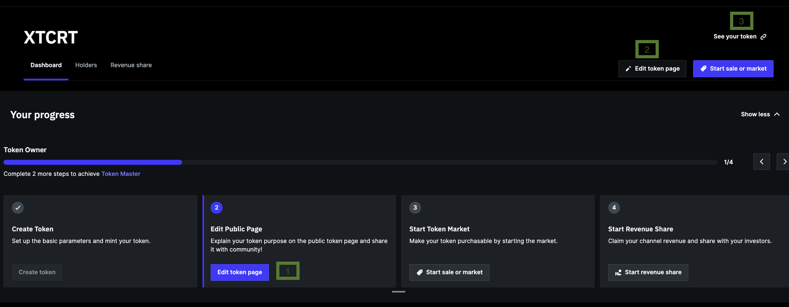
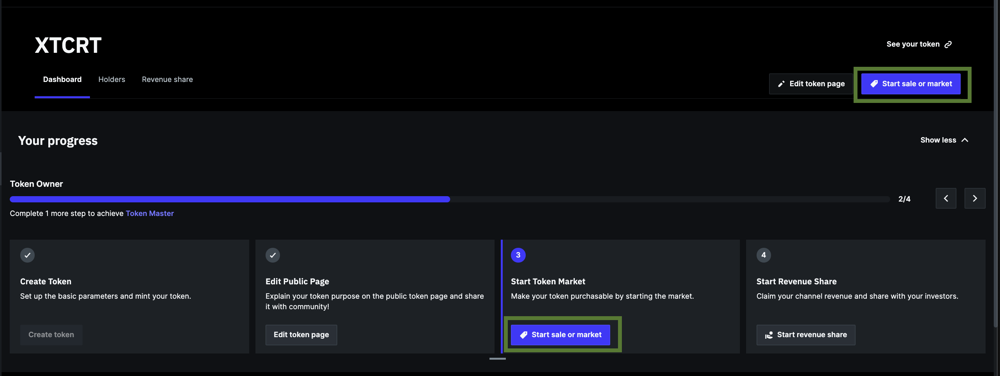
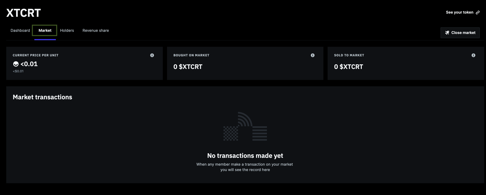
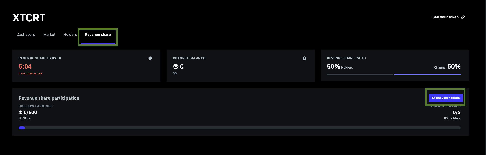
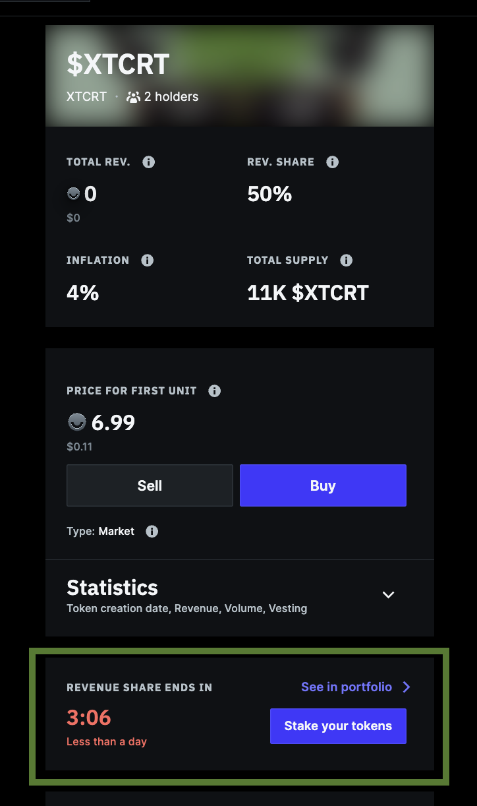
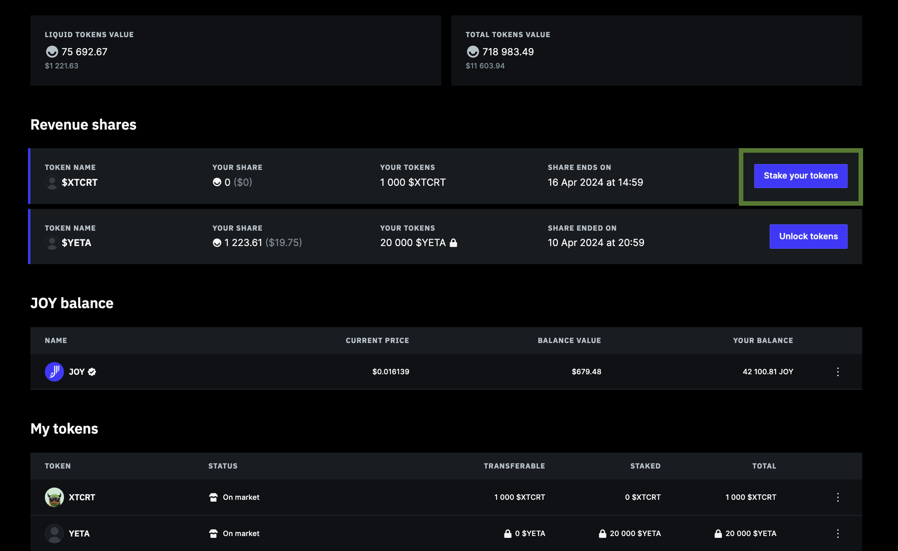
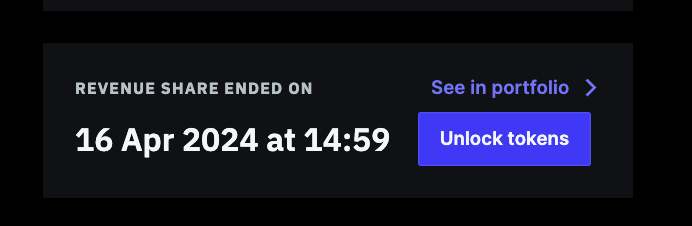

# Blogpost

Status: Done
Project: Creator Token launch (https://www.notion.so/Creator-Token-launch-dd006d8e63f04c1a935fe5189e64c4e9?pvs=21)
Governance Status: Not started
Task ID: GEN-149

Overview

Creator tokens is a feature that allows channels to mint their own tokens and distribute among the community via sale on market. This opens the opportunity for collective channel ownership. 

Token owners can have a claim on the channels revenue originating from creator rewards paid by the DAO and NFT sales. In the future token holders will have an additional utility of accessing exclusive content for token holders and collaboration spaces for the channels community. 

# How to create Token

Any channel can create token starting from the channel page > token tab

Or right from the Token menu item in the channels’ studio view

# Token Parameters

During the minting process creators are free to choose a number of parameters that define the  way how token is presented on the market and economics of the token. 

- Token Name
- Initial token supply
- Ownership permission
- Revenue share %
- Annual channel rewards %
- Token unlock schedule

⚠️ The parameters that the channel chooses during the flow are immutable and stored on the blockchain. That means they are defined forever and cannot be changed, even with the help of the dev team. 

### Token Name

Token name can be only from letters and the max length is 5. It is shown on the marketplace and on the token page. Token name does not have to be unique. This parameter is immutable.

### Ownership Permission

At the time of launch of the feature the only option that is supported is the open ownership where any member can purchase and hold the token. 

The alternative option will allow channels to define the exact membership list who can purchase and own the token. This will unlock supporting exclusive communities. 

### Revenue Share

Creators are paid in JOY tokens, the native asset of the Joystream platform. Rewards from the Joystream DAO are calculated based on the channel's revenue from NFT sales, creator token sales, YPP rewards, and Joystream DAO rewards for engagement and content, subject to the "Creator Rewards" program terms and conditions.

Revenue share allows token holders to claim part of channels rewards (earnings),  proportionate to their ownership of channel tokens supply. Channel owner can create time-bound revenue claiming periods, and token holders stake creator tokens they have for the duration of such period in exchange of receiving JOY tokens, thereby receive portion of channel earnings. Creators set up maximum % of the channel reward account balance that can be claimed by your token holders, the rest gets immediately moved to channel controller account and can be withdrawn.

⚠️ For a channel that has minted creator tokens  the only way how token can claim their revenue, meaning to transfer JOY tokens from channel reward account to channel controller account (and withdraw) is via the revenue share mechanics. 

### Channel Annual Rewards

Channels can earn rewards through automatic tokens minting. This concept works similar to inflation and is also known as `patronage`. Channels can choose the annual percentage of new tokens added to the existing supply, and they will be gradually added to your channels balance over the year. 

💡  It acts like channel inflation per year and high number here decreases the value of existing tokens. From token holder perspective 5% would mean that in 5 years a holder of 100 tokens has  its value similar to 78 tokens now, so a reduction in value of 28%.

### Initial Token Supply

Creator can choose to mint amount of tokens between 3,000 and 100,000.  This limitation was chosen to safeguard creators from undesired scenarios, such as getting diluted with the open market (if <3k minted) or making it prohibitively expensive to purchase a meaningful amount of tokens for any given member to have a meaningful claim on the token revenue. 

**Summary**

Low Supply (3k):

- Higher value per token due to scarcity.
- Attracts investors seeking exclusivity.
- Could lead to lower liquidity (harder to buy/sell).
- Potential for price appreciation as demand grows

High Supply (100k):

- Lower value per token due to abundance.
- More accessible to a broader investor base.
- Supports a more active and inclusive market.
- Lesser impact on token value from new issuances or rewards.

**Detailed implications**

**1. Market Capitalization and Token Value**

- **Lower supply**: With a smaller initial supply, each token represents a larger share of the future revenues. This could lead to a higher price per token, assuming demand is strong. However, it also means there could be less liquidity, as fewer tokens are available for trading.
- **Higher supply** : A larger initial supply dilutes individual token value but can increase market liquidity. Each token represents a smaller fraction of future revenues, which might lower the price per token. However, having more tokens available makes it easier for more participants to buy in without significantly affecting the price.

**2. Accessibility and Distribution**

- **Lower supply**: Fewer tokens could make it harder for a large number of investors to participate, especially if the tokens quickly increase in value. This could limit the diversity and decentralization of ownership.
- **Higher supply**: More tokens allow for a broader distribution among potential investors, promoting inclusivity. This could also help in creating a more stable and decentralized token ownership structure.

**3. Dilution and Future Financing**

- **Lower supply**: Starting with fewer tokens means that any future issuance of additional tokens (to raise more capital or reward users) could significantly dilute existing holders, potentially leading to dissatisfaction among early adopters.
- **Higher supply**: A larger initial supply leaves more room for issuing additional tokens in the future without causing substantial dilution. This could be beneficial if the creator needs more financing or wants to reward community members.

**4. Psychological Factors**

- **Lower supply**: Tokens might be perceived as more valuable or exclusive due to their scarcity, which could attract certain investors. However, this could also lead to hoarding, reducing market liquidity.
- **Higher supply**: A higher number of tokens might be perceived as less valuable individually, but this can make them more accessible to casual investors, possibly leading to a wider user 
base.

### **Tokens Unlock schedule**

Tokens unlock commands what % tokens can be transferred or sold on the market over time. Selecting a longer token unlock period signals the long term commitment of the creator and a sign of a safer investment which drives token demand up.

💡 We strongly recommend to go with the default setting where you will receive 25% of issued tokens now and the rest will unlock gradually over 2 years. 

Advanced users may choose custom values for various parameters governing the token unlock schedule.

**Fully locked period (Cliff) -** During this time tokens from initial allocation cannot be sold or transferred. Setting up the cliff signals to your investors that they can be 100% sure the token price on the market during this period will be exclusively impacted by market conditions. This is a strong signal of integrity.

**Vesting Period -** Period during all minted tokens get fully unlocked. Longer vesting periods signal longer term intentions and prevent from making mistakes with tokens pricing and transfers.

**First Payout -** A portion of your tokens that will be available for trading after locked period expires. We suggest to choose a value less than 50%.

# Token Dashboard

Token dashboard appears right after the token is minted. It entails a combination of widgets and navigation elements that help to see token stats at a glance, complete the token customisation, manage market and revenue share. 

1. Tabs to navigate through dashboard view, token holders page, revenue share and market (appears when market is open). 
2. At any time one can navigate to the public view of the token using the “See your token” link. Public view of the token presents your token to the buyers, let’s them purchase and sell token on the market or stake the revenue share. 
3. Token onboarding progress and token experience bands. It is advised to progress with onboarding steps sequentially: Edit Token Page, Start Market and Start Revenue share to gradually reach the Token Expert band. 
4. Transferable tokens widget - displays tokens that are not subject to locked period (vesting) or revenue share claims (staked tokens).
5. Staked tokens - indication of your tokens staked in the revenue share. Staking your owned tokens allows to participate in revenue shares and claim part of revenue proportionate to your holding % of the channel’s total supply
6. Total revenue - displays revenue amount that is possible to distribute via revenue share among your membership and other token holders. 
7. Patronage - Percentage increase in overall token supply gradually minted over the course of 1 year. This is token inflation which is paid to channel owner as annual reward.
8. Holders Widget - displays the % of tokens owned by all holders, including yourself. 
9. Revenue share widget displays revenue share progress, timing, amount distributed and statistics of claimed revenue of channel by all token holders. 

## Token Experience Bands

During the onboarding flow channels are given the experience level for progressing with the token journey. 

When creators complete the first three tasks, namely 

1. Mint token
2. Update Token Public Page
3. Start Market

`Token Master` level is awarded

💡After all 4 tasks are completed including revenue share, the `Token Expert` level is awarded.  Token expert grants you featuring on the token marketplace and special privileges on Discord and early access to news and beta releases!

# Token Public Page

When the token is first created the public page is the first thing that is advisable to customise.  Creators can access the edit view from the Token Dashboard in the Studio.

Before the page is customised all newly created tokens would look like below for the viewers

Creators can get to the edit view with clicking on the progress bar (1) or edit token page button (2). “See your token” link (3) gets you out of Gleev Studio and transfers to the token view from the viewers side.

### Editing Token

Token public page contains all of the information about the token that new buyers may want to know before purchasing. It supports the video trailer covers your token essense (1), token benefits (2), description (3),  key stats (3), Sale status (4), And additional stats (6).  

⚠️ For the token to appear in the featured marketplace carousel it is mandatory for the Trailer Video to be uploaded.

Once the page is customised creators can click on “See your token” 

And get the the viewers side. This page URL can be shared with prospective community and advertised on social media to attract more buyers. Just copy the token URL from the browser address and share it with your perspective community. 

# **Token Sales on Market**

Token  Sales allow creators to grow the community of channel co-owners, and sell own initially minted tokens back to the market to the same amount that was purchased by others. 

Starting the sale is possible at any time from the respective widget on the token dashboard. 

## **Open Market (AMM)**

Helps to buy and sell tokens by using price curves which automatically set prices and match buyers and sellers.

- Buyers mint new tokens in addition to existing supply with every purchase
- Price is set up by the market, it goes up when someone buys tokens
- Unlike with NFTs, No royalties are earned by other people trading on the market.
- Can be closed any time provided closing liquidity conditions are met.

Importantly, at the point of market start the price for each Creator token is set to default low value. With every purchase it goes up. So at the point of closing the market creators will exchange their own tokens for JOY, contributed to liquidity pool by all other token buyers. 
 

Do not forget to share the token page using the link in the prompt with your potential community to maximise the sales potential.

Once the market is started, all members can purchase Tokens in exchange for JOYs

When someone buys or sells tokens in the market they will be displayed in the Market Tab on the Token Dashboard

💡 To close the market channel needs to sell equal amount of tokens that were bought on the market by other members.  The market can be closed from the Dashboard

## Market Price Curve

In the open market, the exchange rate is determined by the Automatic Market Maker curve formula, which is controlled by the Joystream dev team. 

The formula is 
**`JOY(x) = .5 * slope * [(x + amm_provided_supply)^2 - x^2] + intercept * x`**

where  `slope` is a function of USD to JOY exchange rate, `amm provided supply` is number of tokens already purchased on the Market and `intercept` is 0. 

## **Public Sale**

****⚠️ This feature is planned to be launched later.

Helps to raise funding by selling a certain number of tokens to the public at a set price over a certain period.

- Creators sell the tokens that already have
- Price is set up by creator, same for all buyers and does not change
- Has pre-defined duration set by creator

# Revenue Share

Once the token is launched, creator can only claim their channel revenue via the mechanics of Revenue share. 

## Starting Revenue Share

Revenue share can be started from the Payments dashboard

Or from the Token Dashboard

💡In order to start the share, the channel’s reward account must have a positive amount of JOY tokens to share. 

Channels cannot choose which portion of their revenue gets included into revenue share. At any time when revenue starts all of the available balance on the channel reward account gets included into the revenue share available for holders to claim. 

### Claiming Revenue for Token Holders

Revenue share is a process that has a start and end date. During the active revenue share all token holders can claim their part of the revneue proportionate to their holding of channel token total supply. 

During the times when revenue share is active, all holders will receive a notification about the revenue share started and can claim their part by staking. 

For creators, staking is available from the widget in the revenue share tab as well as from the options also available for all holders

For non-creator holders staking is accessible from the token page 

And from the member portfolio page, which can be found in the members drop down, after clicking on Gleev profile

Once in portfolio, it is possible to stake tokens from the revenue share widget

💡The proceedings of revenue happens right at the point of tokens been staked. All revenue is paid in JOY tokens and credited to member’s account.  The amount of received JOY will be displayed in the modal just before tokens are staked. 

## Rev Share Ended - Unlocking (unstaking) Tokens

After tokens are staked for revenue share claim, they are not available for sales or transfer. One needs to wait for the revenue share to end before tokens can be unstaked.

Creators can close the revenue share from the  only once their tokens are unstaked. 

 Importantly, one can only participate in future revenue shares with unstaked tokens, so unstaking from all previous revenue shares is important to participate in future or currently active revenue shares for the same channel. 

Unstaking of tokens are done in the same interfaces where tokens are staked for revenue share (revenue share claimed).

- Token Dashboard > Revenue share tab (for creators)
- Portfolio page (for all)
- Token Page (for all)

# Token Marketplace

Token marketplace allows prospective buyers to navigate across all minted tokens and discover ones for purchasing.  It supports featured list, and shows top seller leaderboard. It is placed in a separate tab on the marketplace, next to NFTs.

Only creators, who have reached the Token Expert status will be featured on the marketplace in featured carousel. That means that they must

- Edit public token page
- Start Market at least once

- Start Revenue share at least once

The featured section is limited to 10 tokens at a time and periodically updated by the DAO content working group. 

# 

# **Creator Tokens Terms and Conditions**

These Terms and Conditions ("Terms") govern your use of the Creator Token feature on Gleev platform ("Platform"). By accessing or using this feature, you agree to these Terms. If you do not agree to these Terms, you may not purchase or sell any creator tokens.

**Liability Limitation:**

- Gleev shall not be liable for any claims, including loss of value, arising from the minting, sale, or ownership of tokens on the platform.
- Gleev shall not be liable for any disputes between creators, token holders, and the platform regarding token ownership, revenue sharing, or any other related matters.
- Specific risks and scenarios that Gleev seeks to limit liability for include Joystream native token JOY value fluctuations, platform downtime, disputes over token sales, and scenarios where creators or holders get diluted above their expectations.

**Dispute Resolution:**

- Any disputes between creators, token holders, and Gleev shall be resolved through arbitration, in accordance with the rules and procedures set forth by the Joystream DAO.

**General Provisions:**

- Users of Gleev acknowledge that the platform and services are provided "as is" and "as available" without warranties of any kind.
- The platform is not liable or obliged to make payments and, in case of errors, will seek to provide support in reconciliation of payments but is not obliged for channel rewards.
- In case of disputes over content quality and qualification for rewards, the platform has no liability to compensate the channels, and payouts are made at the total discretion of the Gleev App operator and the JS Genesis AS team.