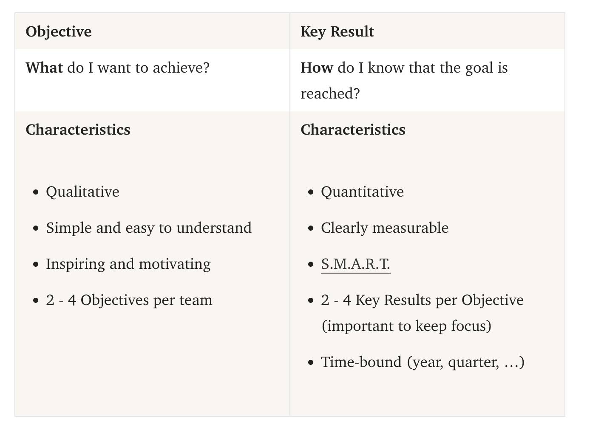

# OKRs

[Joystream OKRs](OKRs/Joystream%20OKRs%20d56666b02cf64a3c886c975c80e5a94c.csv)

**Q2 2024 OKRs**

Q2 2024 OKRs - V1 [https://pioneerapp.xyz/#/proposals/preview/881](https://pioneerapp.xyz/#/proposals/preview/881)

Q2 2024 OKRs WG Level - V1 [https://pioneerapp.xyz/#/proposals/preview/900](https://pioneerapp.xyz/#/proposals/preview/900) 

# drafts

Useful links

[OKR method explained: A complete guide to OKRs](https://mooncamp.com/okr/#1-okr-as-a-framework)

Insights:

- Before signing off OKRs for this quarter let’s reflect on OKRs last quarter. Focus on learnings.
- Have regular OKR checkins - we use WG meetings for that (Content and Marketing Weekly/ Tech biweekly/ Need to add one for council and HR)
- 

## OKR Q2 discussion archive

## 04 April - Draft OKRs for Q2

Draft OKRs for Q2

⭐ **MISSION: MAKE JOYSTREAM A LEADING VIDEO PLATFORM**

- **O1: Grow market capitalisation**
    - KR1: MCAP vs Benchmark group grew x2 by end of quarter (CMC)
        - O (Council) Facilitate barrier-free purchases of JOY tokens
            - *[examples: provide deep liquidity, new chains, new exchanges, argo bridge, better UI]*
            - KR (B): Community bridge shipped
            - O (Council) community bridge runs smoothly
                - KR1: Avg time to approve tx is X
            - O (JSG) New listings?
        - O (Marketing) Increase overall awareness & conversions of Joystream
            - O (M) social media conversions to Joystream.org
                - KR1: CAC and CR to [joystream.org](http://joystream.org) is calculated and budget allocation adjusted towards winning channel
                - KR2: Link Tree click metrics to page XYZ grow by y%
                - KR3: Community bridge landing page hits are X% per 1k USD spent
                - KR4: Ambassadors driving x% [js.org](http://js.org) hits at y% of the budget
        

- KR1.1: MCAP vs Benchmark group grew x2 by end of quarter (CMC)
    - O (Marketing) Increase overall awareness of Joystream
    - O (Council) Facilitate barrier-free purchases of JOY tokens
        - *[examples: provide deep liquidity, new chains, new exchanges, argo bridge, better UI]*
    - O (Council) Reduce the supply of JOY tokens in circulation
        - *[examples: increase amount of JOY staked, maintain low selling pressure from the JOYs distributed by DAO → low inflation rates, high locks ], [examples: adjust fee for video uploads, etc]*
- **O2: Increase Platform usage (Make more people use Gleev)**
    - KR1: Increase weekly onboarding rate of new creators x5
        - O (C) Referrals are at 50% for new channels onboarded (50% of channels generated referral link)
        - O (M) Ambassadors a
    - KR2: Increase Gold+ channels x20 by end of Q2
    - KR3: Number of weekly sessions per user x2 (Amplitude)
    - KR4: DAU and MAU of Gleev App x3 (Amplitude)
    - KR5: Hours of videos uploaded directly

- **O3: Strive for product market fit  (Make people who use it use Gleev more )**
    - **KR1: Engagement Metrics Targets are met**
        - Product
            - Avg session duration for Mobile users x3 (Amplitude)
            - Number of videos watched to 75%
            - Total Minutes watched
            - Total number of followers for all channels x2
    - **KR2: Feature Utilisation Metrics targets are met**
        - CRT
            - 80% of Diamond Channels Mint creator token (Orion)
            - 60% of Gold+ Channels Mint creator token (Orion)
            - 30% of Silver+ Channels mint creator token (Orion)
            - 0.5% of all repeat users buy at least 1 creator token (Amplitude)
        - NFT
            - NFTs minted per Silver+ channels x5 (Orion)
            - Sales of NFTs on marketplace x2 (Orion)
    - **KR3: Retention metrics targets are met**
        - Churn (1 m inactive) is < 30%
        - NPS is 7+
    
    - **KR3: Provide sufficient infra**
        - Manual uploads
        - Playback latency
        - Able to scale on request
        - Cost optimised for current needs
    
    O4: Improve efficiency of DAO operations
    
    - KR1: Finance function is helpful with daily operations and planning
    - KR2: HR function’s operations NPS is increasing based on survey from leads and council in the beginning of each month
    - KR3: Council operations NPS is 7 based on survey from leads and council in the beginning of each month
    

### **O1: Grow market capitalisation**

- KR1.1: MCAP vs Benchmark group grew x2 by end of quarter (CMC)
    - O Increase overall awareness of Joystream
    - O Increase *conversion* of Joystream
    - O Facilitate barrier-free purchases of JOY tokens
    - O Reduce the supply of JOY tokens in circulation

### **O2: Strive for product-market fit  ~~(Make people who use it use Gleev more)~~**

- **O2.1: Make more people use Gleev**
    - KR1: Increase weekly onboarding rate of new creators x5
        - O (C) Referrals are at 50% for new channels onboarded (50% of channels generated referral link)
        - O (M) Ambassadors a
    - KR2: Increase Gold+ channels x20 by end of Q2
    - KR3: Number of weekly sessions per user x2 (Amplitude)
    - KR4: DAU and MAU of Gleev App x3 (Amplitude)
    - KR5: Hours of videos uploaded directly
- **KR1: Engagement Metrics Targets are met**
    - Product
        - Avg session duration for Mobile users x3 (Amplitude)
        - Number of videos watched to 75%
        - Total Minutes watched
        - Total number of followers for all channels x2
- **KR2: Feature Utilisation Metrics targets are met**
    - CRT
        - 80% of Diamond Channels Mint creator token (Orion)
        - 60% of Gold+ Channels Mint creator token (Orion)
        - 30% of Silver+ Channels mint creator token (Orion)
        - 0.5% of all repeat users buy at least 1 creator token (Amplitude)
    - NFT
        - NFTs minted per Silver+ channels x5 (Orion)
        - Sales of NFTs on marketplace x2 (Orion)
- **KR3: Retention metrics targets are met**
    - Churn (1 m inactive) is < 30%
    - NPS is 7+
- **KR4: Provide sufficient infra**

### O4: Improve efficiency of DAO operations

## 30 Apr - OKRs Assessment Q1’2024

- OKR Q4 final review [https://pioneerapp.xyz/#/forum/thread/780](https://pioneerapp.xyz/#/forum/thread/780)
- Q1 2024 OKRs - V1 [https://pioneerapp.xyz/#/proposals/preview/788](https://pioneerapp.xyz/#/proposals/preview/788)
- Q1 2024 OKRs - V2 [https://pioneerapp.xyz/#/proposals/preview/814](https://pioneerapp.xyz/#/proposals/preview/814)

### **O-1-1 Improve Joystream as a Video Platform**

- **KR-1.1 [Distributors] Ensure median bandwidth > 20 Mbps and median TTFB < 350 ms for all deployment locations (*across multiple tests*).**
    - Score 1.0
- **KR-1.2 [Storage] Maintain percentage of lost objects 0%. Maintain percentage of unaccepted objects < 1%. Maintain a replication rate of not lower 2 for all objects. Maintain an average node availability of 99.9%**

### **O-1-2 Improve Joystream as a Blockchain Project**

- **KR-2.1 [Council] Average block time is less than 6.1s**

### **O-1-3 Improve Joystream DAO Governance**

- **KR-3.1 [HumanResources] Conduct 2 anonymous surveys to understand whether DAO workers are satisfied with governance and working conditions.**
- **KR-3.2 [Builders] Pioneer Validator dashboard**
- **KR-3.4 [Council] DAO pay structure**

### **O-1-4 Enhance Joystream user adoption**

- **KR-4.1 [Marketing] Joystream is listed on at least 2 more CEX**
- **KR-4.2 [Marketing] At least 25 new Joystream-related review videos targeted at crypto audiences are posted on Youtube**
- **KR-4.3 [Marketing] At least 3 new interviews with Joystream team are conducted and published**
- **KR-4.4 [Marketing] Reach 32,000 non-empty channels and 1,400,000 non-spam videos on Joystream by the end of Q1**
- **KR-4.5 [Marketing] Onboard 10 Marketing Ambassadors**
- **KR-4.7 [HumanResources] At least 3 community events or workshops are organized aimed at/for content creators during the quarter. The total views of the event recordings should not be fewer than 500 views across all platform for all 5 videos.**
- **KR-4.8 [Marketing] Achieve a 20% increase in total social media impressions compared to the previous quarter**
- **KR 4.9 [Content] At least 5 gold+ tier creators have created a creator token**

### **O1: Grow market capitalisation**

- KR1.1: MCAP vs Benchmark group grew by 50% by end of quarter (CMC)
    - Increase overall awareness of the project. Increase the conversion rate from awareness to purchases
    - Increase community engagement
    - Facilitate barrier-free purchases of JOY tokens
    - Reduce the supply of JOY tokens in circulation
    - Improve the utility and usage of JOY
        - KR1.1.1 (content+marketing): Get not less than 100 M JOY tx volume on all CRTs

### **O2: Strive for product-market fit**

- KR2.1: NPS ≥ 7
- KR2.2: MAU and DAU to be [x1]* times more
- KR2.3: Active user has session duration ≥ [x2] minutes
- KR2.4: Avg session number per user per month ≥ [x3]
- KR2.5: 30D retention rate ≥ [x4]%

### **O3: Improve efficiency of DAO operations****

*(*) The numbers [x1], [x2], [x3], [x4] are under discussion.*

*(**) We recognize the goal's importance and we're trying to persue it, but currently lack a clear method how to measure it effectively. If we figure that out, we'll add it to our OKR list.*

*[x1], [x2], [x3], [x4] numbers are under discussion* 

- O (distribution): Ensure distribution robust infrastructure
    - KR1

## OKR Q2 - Final

### **O1: Grow market capitalisation**

- KR1.1: MCAP vs Benchmark group grew by 50% by end of quarter (CMC)
    - Increase overall awareness of the project. Increase the conversion rate from awareness to purchases
    - Increase community engagement
    - Facilitate barrier-free purchases of JOY tokens
    - Reduce the supply of JOY tokens in circulation
    - Improve the utility and usage of JOY
        - KR1.1.1: Get not less than 100 M JOY tx volume on all CRTs

### **O2: Strive for product-market fit**

- KR2.1: NPS ≥ 7
- KR2.2: MAU and DAU to increase **by 30%**
- KR2.3: Average session duration increase **by 30%**
- KR2.4: Avg session number per user per month **by 30%**
- KR2.5: 30D retention rate increased by **30%**

### **O3: Improve efficiency of DAO operations ***

*(*) We recognize the goal's importance and we're trying to pursue it, but currently lack a clear method how to measure it effectively. If we figure that out, we'll add it to our OKR list.*

## **Content WG**

**O1**

**Utility of JOY**

O1KR1: Get not less than 100 M JOY tx volume on all CRTs

- WG level KR: Ship incremental improvements of CRTs by end of Q2 (New" feature level bubbles for improved discoverability; CRT marketplace shown by default; Direct sale; Discovery improvements based on feeedback; Notifications; Trending tokens)

**Barrier Free Purchase**

O1KR2: ChangeNow modal in Gleev is visited by 5% of all users

**Community Engagement**

O1KR3: Hold 2 creator roundtable events

O1KR4: Grow creators Discord community to 300 participants (role = creator)

**O2**

Comment - since the metrics outlined under this objective have never been the focus, we do not have any imperical sensitivity levels on features delivered vs impact measured. Let's put arbitrary 30% and track regularly to be able to set realistic stretch targets for Q3. Same with NPS, this indicator would not be possible to improve within the quarter, but we can measure it and identify the aspects of product that can be worked on.

- KR2.1: Measure NPS and create roadmap targeting critical feedback items. (comment: I don't think NPS can be substantially increased over the course of 1.5 months)
- KR2.2: MAU and DAU to increase by 30%
- KR2.3: Average session duration increase by 30%
- KR2.4: Avg session number per user per month by 30%
- KR2.5: 30D retention rate increased by 30%

## Distribution

**mr_bovo**

I go through each objective and express thoughts / derived DWG objectives

### **O1**

Nothing to add

### **O2**

- I think the objective name is misleading: I believe we already have a niche and it's not technically a product market fit. I would simply change the name to say Increase Userbase (but that's simply a cosmetic change)
- Regarding values chosen, I agree with the one above by  ***@dmtr***, they are ambitious and that's fine
- Regarding deriving specific objectives for DWG, I am not fully sure how much improvements of the Content delivery network is needed in order to achieve the desired data. It's common sense to expect some causality (eg if the atlas video page takes 15s to load then user retention rate cannot increase because the website will become too laggy). In that regard I think the most concrete way I can proceed is to continue improving our TTFB and Bandwidth as they are the most important metric that will potentially deter user and permits (but not guarantee) achievement of KR2.(1-5). That's pretty much what the Distribution WG can do in this aspect.I will follow up with a detailed measurement process and target values as the subject is quite technical and not within the general spirit of this post

### **O3**

I have some points to this, that I have already discussed with some previous council members and Leads alike

- KR: 3.1 Meeting duration: Every scheduled meeting must have an established start and end time. (Time must be respected). Furthermore Meetings longer that 1h should be avoided as people usually start loosing focus.
- KR: 3.2 Meeting efficiency: Every meeting (whenever possible) should have an agenda planned in advance (to avoid detours) also at the end every meeting should have at least a clear list of actionable steps to take. I can take charge of this for the Infra alignment call

## **BWG**

### **O1**

1. Deliver Argo Ethereum bridge.

### **O2**

1. Deliver Metamask support for Atlas and Pioneer.

### **O3**

1. Deliver S3 support and archival mode support for storage node to drive costs down.
2. Deliver improvements to the report tool that will allow:
    1. Easy and reliable report generation.
    2. Collecting CRT metrics.

I know those are not proper KRs (progress is 0→1, not really measurable), but don't have an idea of how to state them differently. Happy to hear suggestions or other items worth adding for BWG.

## HR

**Codefikeyz**

O1

- Research ideas to increase creators community engagement ([Main focus](https://discord.com/channels/811216481340751934/812344710710296646/1235575520436158597))
- Increase support by X% regarding community inquiry on JOY token purchase (recommend usage of video tutorials by ambassadors)

O2

- Conduct a bi-weekly training session for community managers to enhance product knowledge and support skills, aiming for an average NPS increase of 1 point each month. (NPS = handled by CWG)
- Co-facilitate 2 Creators rountable event in collaboration with CWG
- Establish a **community buddy program**, pairing new users with experienced community managers/members to provide guidance and support during their initial interactions with the platform, with the goal of improving the 30-day retention rate by [x4]% compared to the previous quarter. (For community members, this can be voluntary, where a comprehensive report of their activity is drafted and forwarded to the HR Lead, who examines the report and rewards member with X amount of token at the end of the term. This is totally subjective to and at the lead's discretion. Report is likened to HR community managers too)

[**Q2 2024 OKR - Final Review (full draft)**](OKRs/Q2%202024%20OKR%20-%20Final%20Review%20(full%20draft)%2068b114f417c74cc28660f43c252fff3a.md)

[**Q2 2024 WG OKRs - Final Review (Pioneer edition)**](OKRs/Q2%202024%20WG%20OKRs%20-%20Final%20Review%20(Pioneer%20edition)%200857568202414403b45e068ee5d35f10.md)

# OKRs Q3’24 [14 Aug 2024 upd]

# **DAO level**

### **O1: Grow market capitalisation**

- KR1.1: MCAP vs Benchmark group grew by 50% by end of quarter (CMC)
    - KR1.1.1: Get not less than 10 M JOY tx volume on all CRTs

### **O2: Strive for product-market fit**

- KR2.1: NPS ≥ 7
- KR2.2: MAU and DAU to increase by 30%
- KR2.3: Average session duration increase by 30%
- KR2.4: Avg session number per user per month by 30%
- KR2.5: 30D retention rate increased by 30%

# **WG level**

## **Marketing WG** [14 Aug 2024 upd]

**O1: MCAP vs Benchmark group grew by 50% by end of quarter (CMC)**

- **KR1.1**: Achieve a 33% per quarter increase in first-time visitors to the [Joystream.org](http://joystream.org/) and Gleev.xyz websites, maintaining the conversion rate to the target actions (1) at least as good as it is now

> comment: July1-Aug13/ over the prev quarter → we gonna achieve the target; 50% completion
> 

> 11/9/24 WG lead’s comment: 0% (negative dynamics, Gleev traffic dropped by approx 60%)
> 

- **KR1.2:** Secure at least 5 new high-profile YouTubers. Each of them should post at least one video, with each video garnering at least 5k views.

> comment: need to double check the actual view number; will be updated next week on MWG call
> 

> 11/9/24 WG lead’s comment:  20%
> 
- **KR1.3**: Increase the TwitterScout score by 100 points per quarter (currently at 385 points). Achieve at least 15% growth per quarter in the following categories: VCs subscribed (currently 37), Influencers (currently 212), and projects subscribed (currently 73).

> comment: no growth; key result is at risk; we are actively looking for the Twitter Manager / Content manager; 0% progress so far
> 

> 11/9/24 WG lead’s comment:  1% (current score = 388)
> 
- **KR1.4:** Maintain a monthly updated list of all newly SocialFi and creator economy industry research posted on Twitter and major crypto outlets. Ensure that we reach out to each author if Joystream is not mentioned.

> comment: data to be provided next week on MWG;
> 

> 11/9/24 WG lead’s comment:  100% mwg reached to all founded industry research where js was missing
> 
- **KR1.5**: Participate in at least 1 external Twitter Spaces per month related to the creator economy and SocialFi, and host at least 1 Twitter Space of our own per month.

> comment: we had 1 in July; we had 2 Twitter spaces in August (not many viewers participated so far?); Twitter Spaces will be every week on Saturdays; Full access to DAO Twitter is needed
> 

> 11/9/24 WG lead’s comment:  75% completion
> 
- **KR1.6:** Reach out to crypto projects (our wallet providers, exchanges, JSG investors, etc) and ensure at least 5 new per month start using Gleev reguraly. Plan to offer a branded section for them or feature new projects, with details to be discussed and finalized with Dmitry.

> comment: New UX is to be rolled out on Gleev to feature partner projects; Seek JSG support to ship this UX asap
> 

> 11/9/24 WG lead’s comment:  0%
> 
- **KR1.7:** Achieve at least 10,000 unique views on the marketing activities about the JOY/ETH trading pair on DEX, within one month before the launch, focusing on the existing Base community through targeted marketing efforts.

> comment: Argo Bridge has not been launched yet
> 

> 11/9/24 WG lead’s comment:  0% (pair not announced yet)
> 

**O2: MAU and DAU to increase by 30%**

- **KR1.8**: MWG campaigns generated at least 100 new creator sign-ups per month (monitored through UTMs, referral links, etc.), ensuring the quality distribution is maintained or improved compared to the previous quarter

> comment: data to be provided in the next MWG call;
> 

> 11/9/24 WG lead’s comment:  10% (KR at risk due to problems with YPP)
> 

## **Builders WG** [14 Aug 2024 upd]

- KR1.1: Deliver Argo Ethereum bridge. (1)

Comment: all progressing nicely; to be delivered next week; very close to the launch 

> 11/9/24 WG lead’s comment:
> 

Launching this week 🤞

- KR1.2: Deliver S3 support and archival mode support for storage node to drive costs down (2)

Comment: no progress; JSG didn't provide feedback or support; Mokhtar will provide assistance soon  

> 11/9/24 WG lead’s comment:
> 

First round of review and followups has been done. Bedeho said Mokhtar will finish the development in coming weeks.  

- KR1.3: Develop and deploy Progressive Web App for Atlas/Gleev (3)

Comment: no progress; fully focused on the bridge so far; 

> 11/9/24 WG lead’s comment:
> 

Same as above.

- KR1.4: Implement improvements to the Gleev, Atlas and Orion (4)

Comment: no progress; (tasks to be picked up from backlog at a later stage → that was not done so far)

> 11/9/24 WG lead’s comment:
> 

Same as above.

Comment: SDK to be included into Q3 OKRs?

**Comments**

(1) Argo bridge work includes:

- Contract deployed on Base,
- bridge runtime pallet integrated into Joystream,
- AMM on Base started,
- UX bridging portal rolled out,
- comprehensive guide for operators published,
- two pilot transfers in each direction completed with zero over-minting incidents on both Ethereum and Joystream sides.

(2) To be reviewed by JSG: only they can actually do that

(3) Progressive Web App work includes:

- Feature parity when all existing features on [https://gleev.xyz/](https://gleev.xyz/) are replicated in the PWA: Main (Browse page), CRT marketplace, NFT marketplace, YPP page, Referrals page, Profile page
- Add push notifications for updates and messages, and include a system for users to manage their notification subscriptions.

(4) Specific tasks to be picked up from backlog at a later stage, prioritized by the Council and CWG lead, and execution assessed by JSG

> 11/9/24 WG lead’s comment:
> 

No tasks were ever picked.

## **Distributors WG**

**O1: Provide quality values for bandwidth and latency accross geographical regions with sufficient traffic, keeping the cost of operation minimal**

- KR1.1: [if the SpeedTest comparison is successful for t = 30 days time window then the OKR is reached at 100% (meaning: good values for Latency and Bandwidth for June 2024)](https://www.notion.so/OKRs-Q2-2024-2e583262bea940009bb26799a55c832c?pvs=21)

## **Storage WG**

**O1: Provide reliable storage infrastructure, keeping the cost of operation minimal**

- KR1.1: Maintain percentage of lost objects 0%
- KR1.2: Maintain percentage of unaccepted objects < 2%
- KR1.3: Maintain a replication rate of not lower 2 for all objects
- KR1.4: Maintain a storage objects availability of 100%

11/9/24 WG lead’s comment:  

## **Content WG**

**O1: Grow market capitalisation**

- KR1.1: Ship incremental improvements of CRTs
- KR1.2: New onramp and ChangeNow modals in Gleev is visited by 5% of all users
- KR1.3: Hold 1 creator roundtable event
- KR1.4: Grow creators Discord community by 500 participants (role = creator)

**O2: Strive for product-market fit**

- KR2.1: Provide weekly updates to the council on key feedback from NPS surveys. Discuss the urgency and agree on the strategic implications.
- KR2.2: MAU and DAU to increase by 5% MoM
- KR2.3: Avg session number per user by 5% MoM
- KR2.4: Average session duration increase by 5% MoM
- KR2.5: 30D retention rate increased by 5% MoM

## **HR WG** [14 Aug 2024 upd]

**O1: Keep community informed and engaged**

- KR1.1: Ensure that all community questions receive an initial response within an average of 2 hours, both in Discord and Telegrem, even if a complete answer is not immediately available.

Comment: All good; 

> 11/9/24 WG lead’s comment:
Going pretty well. Although we had 1 community moderator in HR temporarily relieved of his duties, the Lead tries to moderate the community and respond to enquiries during CEST mid/late hours.
> 

  

- KR1.2: Organize and facilitate daily standups, handover meetings, mid-term meetings, as well as weekly and biweekly WGs meetings, ensuring comprehensive meeting notes are provided for each session.

Comment: All good; 

> 11/9/24 WG lead’s comment:  Going smoothly, community members are also being encouraged to join meetings via announcements.
> 
- KR1.3: Deliver DAO community weekly reports with an average delay of no more than 1 day

Comment:All good; 

> 11/9/24 WG lead’s comment:  In good progress, We recently encountered an issue with the council report tool that led to a delay in publishing. BWGL will look into this at a convenient time.
> 
- KR1.4: Implement 5 innovative ideas to enhance Discord onboarding and improve community engagement for token holders.

Comment:

> 11/9/24 WG lead’s comment:  A draft was submitted to council to execute some ideas, which is still in review currently. Hopefully it can be attended to soon with the appointment of a new discord admin and with the rise in spam/malicious posts by users.
> 
- KR1.5: Co-facilitate 1 Creator roundtable event in collaboration with CWG.

Comment: Since CWGL is less available now this KR may be harder to achieve;

> 11/9/24 WG lead’s comment:  This was kind of reviewed into a different version of having creators roundtable on Twitter facilitated by MWG, for more engagement and audience.
>