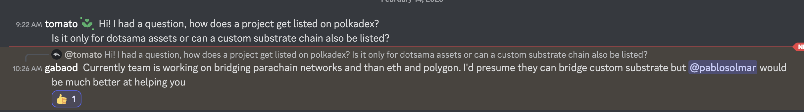

# exchanges

- Polkadex
    - asked about listing process in their Discord: [https://discord.com/channels/859180272335323166/930235505596071998/1074832874404057178](https://discord.com/channels/859180272335323166/930235505596071998/1074832874404057178)
    - 
    
    
    
- Novawallet
    - [https://github.com/nova-wallet/nova-utils/blob/master/chains/v8/chains.json](https://github.com/nova-wallet/nova-utils/blob/master/chains/v8/chains.json)
    - Needs a PR to be created
        - prefix:
        - 
        
        
        
- 
    
    ```jsx
    {
      "name": "Joystream",
      "id": "joy_mainnet",
      "chainType": "Live",
      "protocolId": "joy_mainnet",
      "properties": {
        "ss58Format": 126,
        "tokenDecimals": 10,
        "tokenSymbol": "JOY"
    ```
    
- Subquery (indexing service)
    - 
    
    